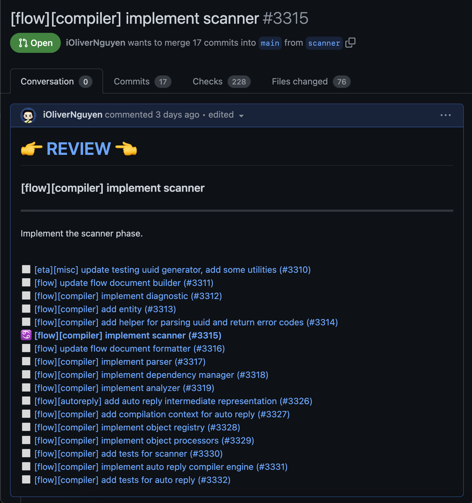

# git-pr

`git-pr` is a command line tool to create and update GitHub pull requests within stacked commits.

While working with stacked commits, we need to make change and push these commits to GitHub. Because a stack of commits
has many commits, pushing them all to GitHub requires multiple invocations of `git push`, one for each commit, which is
tedious. `git-pr` helps you to push all commits to GitHub and create stacked pull requests, one for each commit. The
reviewers can review each PR by clicking the 👉 **REVIEW** 👈 link, which point to the corresponding commit for that
PR. Read more at [the introduction article](https://olivernguyen.io/w/stacked.prs).



## Why?

I usually work with stacked PRs, as it is a great way to organize my work. Usually, I use
[sapling](https://olivernguyen.io/w/sapling/) to manage my stacked PRs, and it works really well. I can make changes
to multiple commits at a time by `sl absorb`, and push all of them by `sl pr`. However, a few days ago, I pushed a stack
of commits with the creation of 17 PRs in one go, which were over GitHub's rate limit and got a temporary ban:

```sh
$ sl pr 2>&1 | go run ~/ws/conn/be/go/scripts/slpr
pushing 17 to https://github.com/myorganization/backend.git
created new pull request: https://github.com/myorganization/backend/pull/3310
...
created new pull request: https://github.com/myorganization/backend/pull/3319
abort: error creating pull request for f05689dca505b3ad1b526a220d7a15f46b4a9511: {
 "message": "You have exceeded a secondary rate limit and have been temporarily blocked from content creation. Please retry your request again later.",
 "documentation_url": "https://docs.github.com/rest/overview/resources-in-the-rest-api#secondary-rate-limits"
}
```

This left my sapling repository in a bad state. The local commits and the GitHub PRs no longer match. I can not update
PRs with sapling anymore. The problem is that sapling is not compatible with my local git tools and I do not know the
internal of sapling enough to be able to fix it.

```sh
$ sl pr
pushing 8 to https://github.com/myorganization/backend.git
abort: `git --git-dir /Users/i/ws/conn/be/.sl/store/git push --force https://github.com/myorganization/backend.git 447c5d073cbadd4bcc251bf8bcd46d9ec4f728bd:refs/heads/pr3320 3f0d1e3103e5246e29806f44b87f4e9289749202:refs/heads/pr3320 7403ecce2590066177a23923bbd509598fe32781:refs/heads/pr3321 8750722250395b8d7e5a2e624a5c65a42ee817e0:refs/heads/pr3322 b543123ebadcca0b1de95293fd551752e1fa0c43:refs/heads/pr3323 263fde607355872bb47305168bf1907d673b0249:refs/heads/pr3324 5b590681dbe1394b7cae9a7d1e9f823205da3cc7:refs/heads/pr3325 17137b286aa5376615a77e58f3ef71bf02a3398f:refs/heads/pr3326` failed with exit code 1: stdout:
stderr: error: dst ref refs/heads/pr3320 receives from more than one src
error: failed to push some refs to 'https://github.com/myorganization/backend.git'
```

So I decided to switch back to Git with [git-branchless](https://github.com/arxanas/git-branchless) for managing stacked
commits and writing this tool for pushing GitHub PRs. This tool simply adds a line `Remote-Ref: <remote-branch>` to each
commit to manage the corresponding PR. No other magic. So I can confidently work with stacked commits again and use my
Git knowledge to fix problems if they happen. Read more at [this article about working with stacked
PRs](https://olivernguyen.io/w/stacked.prs).

## Installation

### Download

- Install [github-cli](https://cli.github.com/) and run `gh login`.
- Install [git-branchless](https://github.com/arxanas/git-branchless) and run `git branchless init`.
- Install git-pr and put `~/go/bin/git-pr` in your `$PATH`

  ```sh
  git clone https://github.com/iOliverNguyen/git-pr
  cd git-pr
  go install .
  export PATH=$PATH:~/go/bin
  ```

## Usage

```sh
git checkout [commit]
git pr
```

Check out the last commit in your stacked commits and call `git pr` to push the stack to GitHub, one PR for each commit.
Add `[draft]` to the commit title to mark it as draft.

### Arguments

```sh
$ git-pr --help
Usage: git pr [options]
  -gh-hosts string
    	Path to config.json (default "~/.config/gh/hosts.yml")
  -include-other-authors boolean
    	Create PRs for commits from other authors (default to false: skip)
  -main string
    	Main branch name (default "main")
  -remote string
    	Remote name (default "origin")
  -timeout int
    	API call timeout in seconds (default 20)
  -v	Verbose output
```

## How it works

- It associates each commit with a pull request by adding `Remote-Ref: <remote-branch>` to the commit message.
- It push each commit to GitHub and create or update the corresponding pull request.
- It detects the login user from [github-cli](https://cli.github.com/).
- It adds a 👉 REVIEW 👈 link, which reviewers can click to access the corresponding commit for that PR and add comments.
- It adds a list of all PRs for that stack at the end of each PR.

## License

MIT

## Author

I'm Oliver Nguyen. A software maker working mostly in Go and JavaScript. I enjoy learning and seeing a better version of my self each
day. Occasionally spin off new open source projects. Share knowledge and thoughts during my journey. Visit my blog at
[olivernguyen.io](https://olivernguyen.io), or connect with my on [GitHub](iOliverNguyen),
[LinkedIn](https://www.linkedin.com/in/iOliverNguyen/), [Twitter](https://twitter.com/_OliverNguyen),
[Medium](https://iOliverNguyen.medium.com/), and [email](iOliverNguyen@gmail.com).
